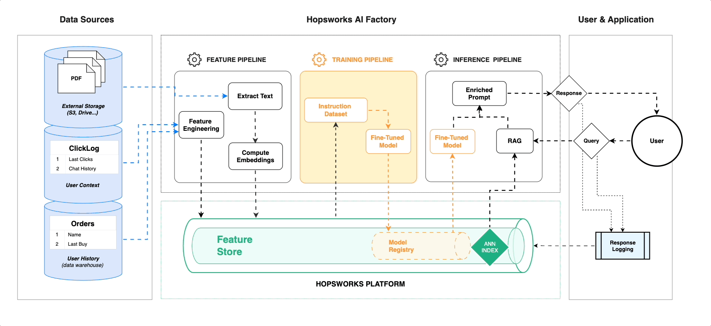

# ⚙️ Private AI Assistant for Investment Professionals

This project is an AI system for investment professionals that can deep dive into how AI impacts portfolio companies. It is built on Hopsworks.

- **Creates** vector embeddings for PDF files from the [Stanford AI Index Report](https://aiindex.stanford.edu/report/), indexing them for retrieval-augmented generation (RAG) in the Hopsworks Feature Store with Vector Indexing.
- **Based** on user input, retrieves top-ranked contexts from the vector database and generates responses using OpenAI's `gpt-4o-mini-2024-07-18` or Google's `Gemini 1.5 Flash` models.
- **Provides** a UI, written in Streamlit/Python, for querying report PDFs and portfolio company websites that returns answers, citing the page/paragraph/url-to-pdf in its answer.



## 📖 Feature Pipeline
The Feature Pipeline does the following:

- Downloads the [Stanford AI Index Report](https://aiindex.stanford.edu/report/).
- Downloads data from selected portfolio companies.
- Extracts chunks of text from the PDFs/websites and stores them in a vector-index-enabled Feature Group in Hopsworks.

## 🏃🏻‍♂️ Training Pipeline
This step is optional if you also want to create a fine-tuned model. Currently, we opted to use OpenAI's `gpt-4o-mini-2024-07-18` or Google's `Gemini 1.5 Flash` models.

## 🚀 Inference Pipeline
- A chatbot written in Streamlit that answers questions about the portfolio companies based on AI report PDFs and company websites.

## 🕵🏻‍♂️ Prerequisites
1. Create a free account on [Hopsworks](https://app.hopsworks.ai/app) and get an API key.
2. Get either a Google Gemini (free tier available) or OpenAI API key.
3. Clone the repository:
   ```bash
   git clone https://github.com/davitbzh/investor_assistant.git
   cd investor_assistant
   ```
4. Create `.env` file and save Hopsworks and Gemini/OpneAI api keys:
   ```bash
    GEMINI_KEY=your_gemini_api_key
    OPENAI_API_KEY=your_open_ai_api_key
    HOPSWORKS_API_KEY=your_hopsworks_api_key
   ```
5. Install required packages:
   ```bash
    pip install -r requirements.txt
   ```    
7. Run pipeline `feature_pipeline.ipynb`. Note that for similicity we choose Jupyter notebook here. However for production environments you can convert this to python script and schedule with prefered cadence.
6. For inference run:
   ```bash
    streamlit run ./app.py
   ```
